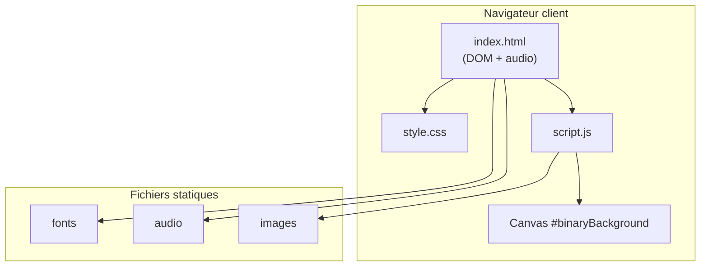

# MJC Safenet

Application web statique de simulation « compte à rebours / piratage » à usage pédagogique ou événementiel (escape game, atelier sensibilisation).

---

## 1. Besoins du client

### Objectifs

- Proposer une **mise en scène immersive** type terminal / cyberattaque sans dépendre d’un backend ni d’infrastructure complexe.
- Offrir un **minuteur visible** (avec précision visuelle élevée), des **retours sensoriels** (sons, animations) et une **zone de saisie de code** pour clôturer le scénario.
- Permettre à un **animateur** d’ajuster durée, code de désactivation et pénalités **sans recompiler** le projet.

### Problématiques initiales

- Éviter toute confusion avec un outil réel d’intrusion : l’expérience doit rester **clairement factice** et **autonome** (pas de connexion à des systèmes réels).
- Garantir une **mise en œuvre simple** sur poste ou vidéoprojecteur (fichiers statiques, pas de chaîne de build obligatoire).
- Assurer une **expérience audio fiable** selon les navigateurs (politiques de lecture média, notamment hors HTTP).

---

## 2. Architecture du projet

### 2.1 Pile technique

| Couche | Technologies |
|--------|----------------|
| Structure | HTML5, sémantique de base, éléments médias natifs (`<audio>`) |
| Présentation | CSS3 (flexbox, animations, `@font-face`) |
| Comportement | JavaScript ES6 (écouteurs d’événements, `CanvasRenderingContext2D`, timers) |
| Ressources externes | Google Fonts (Press Start 2P) — chargement HTTPS |

**Build** : aucun. **Runtime** : moteur JavaScript du navigateur uniquement.

### 2.2 Arborescence du dépôt

```
MJC_Safenet/
├── index.html                 # Document unique, point d’entrée HTTP
├── LICENSE
├── readme.md
└── assets/
    ├── css/
    │   └── style.css          # Thème, layout, animations
    ├── js/
    │   └── script.js          # Logique applicative monolithique (init au chargement DOM)
    ├── fonts/
    │   └── Open24DisplaySt.ttf
    ├── audio/
    │   ├── bip.wav
    │   ├── error.wav
    │   └── gameover.wav
    └── images/
        ├── fail.webp
        └── logo.png           # Référencé par le CSS (#logo) si intégré au HTML
```

### 2.3 Schéma logique (couches)



### 2.4 Modules fonctionnels côté code

| Zone DOM / fichier | Responsabilité |
|--------------------|----------------|
| `#binaryBackground` + `script.js` | Pluie binaire animée (Canvas 2D, redimensionnement fenêtre) |
| `#timer`, `#content` | Affichage du compte à rebours et conteneur principal |
| `#output-console` | Flux de lignes simulées type shell |
| `#terminal`, `#feedback` | Saisie du code, validation, messages utilisateur |
| `#adminPanel` | Configuration animateur (masquée par défaut, raccourci clavier) |

Le point d’exécution est la fonction `init()` dans `assets/js/script.js`, déclenchée sur `DOMContentLoaded` (ou immédiatement si le DOM est déjà prêt).

---

## 3. Cybersécurité

### 3.1 État actuel (limites assumées)

- **Aucune authentification** : le panneau d’administration est accessible via le raccourci clavier **Alt + A** ; toute personne connaissant ce raccourci peut modifier les paramètres en session.
- **Aucun serveur applicatif** : pas de base de données, pas d’API, pas de journalisation centralisée.
- **Logique et secrets côté client** : le code de désactivation et les réglages ne sont pas protégés par chiffrement ; ils sont visibles dans le code source et la mémoire du navigateur.
- **Dépendance réseau** : chargement optionnel de polices depuis `fonts.googleapis.com` (fuite d’information minimale : requête vers Google lors de la visite).

### 3.2 Mesures recommandées selon le contexte d’usage

| Contexte | Recommandation |
|----------|----------------|
| Atelier / escape game contrôlé | Documenter le raccourci admin **uniquement** pour les animateurs ; ne pas présenter l’outil comme un « vrai » système sécurisé. |
| Déploiement public (URL ouverte) | Remplacer le raccourci fixe par un **mot de passe ou code** configurable, ou retirer le panneau du livrable « joueur » et fournir une variante « animateur » séparée. |
| Réduction de la surface réseau | Héberger localement la police Press Start 2P (auto-hébergement) pour supprimer l’appel à Google Fonts. |
| Durcissement général | Servir le site en **HTTPS**, en-têtes de sécurité adaptés (`Content-Security-Policy`, `X-Content-Type-Options`, etc.) sur le serveur web choisi. |

> **Rappel pédagogique** : cette application est une **simulation visuelle et sonore**. Elle ne doit pas être utilisée pour la protection de données sensibles ni comme démonstration de sécurité réelle.

---

## 4. Méthode de déploiement

### 4.1 Prérequis

- Navigateur récent (Chrome, Firefox, Edge, Safari).
- Fichiers sous `assets/` présents et chemins inchangés (voir arborescence ci-dessus).

### 4.2 Environnement cible

Tout hébergement capable de servir des **fichiers statiques** avec le type MIME correct :

- serveur web classique (**Nginx**, **Apache**, **Caddy**) ;
- offres **hébergement statique** (GitHub Pages, GitLab Pages, Netlify, Cloudflare Pages, etc.) ;
- partage réseau local via un mini-serveur HTTP.

La **racine document** du site doit être le répertoire contenant `index.html` (souvent la racine du dépôt cloné).

### 4.3 Étapes types

1. **Transférer** l’intégralité du projet (y compris `assets/`) vers l’hôte ou le bucket statique.
2. **Vérifier** que l’URL racine résout vers `index.html` (souvent configuration par défaut).
3. **Tester** en HTTPS si possible, et valider la **lecture audio** (certaines politiques navigateur exigent une interaction utilisateur avant lecture).

### 4.4 Développement local

```bash
# Exemple : serveur HTTP intégré Python 3, depuis la racine du projet
python3 -m http.server 8080
```

Accès : `http://localhost:8080/`.

> En ouverture directe `file://`, certains navigateurs **bloquent ou limitent** l’audio ; un serveur HTTP local est recommandé pour des tests représentatifs.

---

## 5. Ce que fait l’application / le site

### 5.1 Parcours « joueur »

- Affichage d’un **compte à rebours** au format heures : minutes : secondes : **centièmes**, avec changement visuel sous le seuil d’une minute et **bip** sonore chaque seconde sur la dernière minute.
- **Console factice** : ajout périodique de lignes pseudo-aléatoires évoquant des commandes shell, tant que le minuteur est actif.
- **Fond animé** : colonnes de `0` / `1` sur canvas plein écran ; effets de couleur (alerte) en cas d’erreur ou d’échec.
- **Saisie d’un code** : comparaison stricte (après trim) avec le code configuré ; en cas de succès, arrêt du scénario, message de réussite et effets visuels associés ; en cas d’échec, son d’erreur, **pénalité temporelle** et retour visuel.
- **Fin du temps** : son de fin, message d’échec, animation d’écran, affichage possible d’une image d’échec (`fail.webp`), masquage du terminal de saisie.

### 5.2 Parcours « animateur »

- **Alt + A** : affiche ou masque le panneau d’administration.
- Champs : durée (heures / minutes / secondes), **mot de passe de désactivation**, **pénalité** (secondes par défaut ; unité minutes possible si un sélecteur `#adminPenaltyUnit` est ajouté au DOM).
- Actions : **Démarrer** le minuteur, **Réinitialiser**, **Sauvegarder** les paramètres pour la **session** courante (mémoire volatile côté navigateur, pas de persistance serveur).

### 5.3 Paramètres par défaut (modifiables via l’admin)

| Paramètre | Valeur initiale |
|-----------|-----------------|
| Durée | 60 minutes |
| Code | `netsafe` |
| Pénalité | 10 secondes |

---

## Licence

Projet sous licence **MIT** — voir le fichier `LICENSE` (copyright SandersonnDev).
